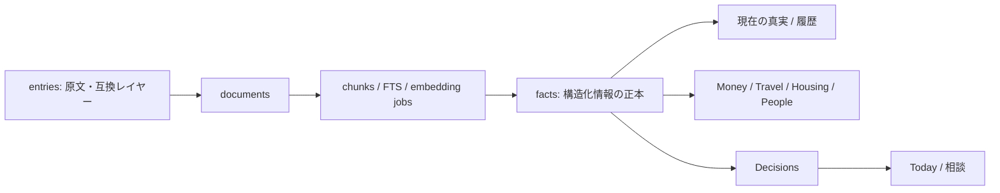

> This repository is a generated, sanitized public mirror. No user runtime database, private history, attachments, or personal context are intentionally included. Direct changes may be overwritten.

# Personal OS

## Rebuild additions (2026-07-26)

- `facts` is the canonical structured-memory layer. `entries` and `structured_memories` remain legacy migration sources and are not used by new projections.
- `fact_evidence` records the immutable source chunk/attachment, quote, source group, support/contradiction flag, and reliability for each Fact. Inspect one Fact with `GET /api/facts/{id}/evidence`.
- `analysis_jobs` now also identifies `job_kind` and `source_attachment_id`. Text and screenshot input are raw-first: the original is committed first and analysis runs asynchronously. `content_hash`, provider, model, and prompt version permit selective re-analysis.
- `recommendations` and `plans` are local, explainable, non-executing stages between retrieval and decisions. Use `POST /api/recommendations/generate`, `POST /api/recommendations/{id}/decision` (optionally `create_plan=true`), `POST /api/plans`, and the Today panel.
- Recommendation生成時は、選択肢をStepsにしたDraft Planを自動作成します。AIが本人のDecisionや外部アクションを自動実行することはありません。
- Backups retain every generation as `.posbackup` bundles containing SQLite、原文、添付画像、manifest、SHA-256 checksums. `GET /api/backup/verify?path=...` verifies the complete generation. Restore requires `confirm=true` and creates a pre-restore bundle first.
- `GET /api/facts/anomalies` reports contradictory same-date values and large numeric outliers without silently selecting a winner.
- `embedding_jobs` is processed by a local deterministic Japanese character-ngram worker (`local-charhash-v1`, 256 dimensions). Chat retrieval order is current facts → decisions → FTS → semantic candidates → raw text; `/api/search?q=...` exposes the ordered result for inspection.
- Narrow privacy deletion is available at `POST /api/privacy/delete` with `confirm_phrase=DELETE`. `GET /api/privacy/delete/preview` shows the exact Fact/Entity/Entry/Attachment scope first. People and screenshot UI use this preview; physical image files and derived OCR/index rows are removed together.

The current Done/Partial/Not implemented status is in `docs/requirements_traceability.md`, `docs/memory_correctness_traceability.md`, `docs/additional_correction_traceability.md`, and `work/requirements_status.md`. `docs/requirements_gap_analysis.md` is retained as the pre-implementation audit baseline.

## Public repository release

Runtime data is deliberately local-only: `data/`, exports, attachments,
backups, `.env`, and `.private_terms` are ignored by Git. Before creating a
public repository, run the complete check from the repository root:

```powershell
.\tools\check_public_release.ps1
```

It checks secrets, likely personal data, forbidden tracked artifacts, and the
unit/benchmark suite, then creates a source-only sanitized snapshot at
`dist/public/`. Requirements, tests, benchmarks, and documentation are kept
synthetic in the working tree as well. See [the public release
procedure](docs/public_release.md) for the local redaction-rule format and
publishing steps.

会話・メモ・判断を、自分だけの長期記憶と意思決定履歴として扱うローカル優先の Personal OS です。Python と SQLite だけで動作し、iPhone からも同一 Wi-Fi 上のブラウザで利用できます。

初めて使う場合は [ユーザーガイド](USER_GUIDE.md) を参照してください。

## 起動

```powershell
cd personal-os
.\tools\start_production.ps1
```

本番は `data/personal_os.db` と固定ポート `8787` を使用します。ブラウザで `http://localhost:8787` を開きます。同一 Wi-Fi の iPhone からは、起動時に表示される LAN URL を Safari で開いてください。PWA マニフェストと Service Worker を含むため、Safari の「ホーム画面に追加」も利用できます。

## データモデル



`facts` が構造化情報の正式な正本です。新しい抽出結果は `facts` にのみ書き込みます。`entries` は原文キャプチャ、`documents` / `chunks` は検索・根拠表示のための不変ソースです。`schema_migrations` は適用済みのDB変更バージョンを記録します。既存の安全な `CREATE` / `ALTER` 方式は維持しつつ、今後の変更を監査できるようにしています。

`structured_memories` と `analysis_status` は移行互換用の legacy テーブルとして残しますが、新機能は参照・更新しません。起動時に legacy の内容を `facts` へ安全に移行します。legacy テーブルは削除しません。

### facts の時間軸と同一性

各 fact は `fact_key`、`valid_from`、`valid_to`、`status`、`supersedes_fact_id` を持ちます。`fact_key` は文章ではなく概念を表します。

- 月間の総積立: `finance.monthly_investment.total`
- 投資信託積立と持株会は、対象（scope）が異なる別キー
- 新しい現在情報が同じキーで保存されると、古い fact は `superseded` になり有効期間を閉じる
- 取引・訪問・イベントは `historical` として履歴を残す

### 拡張可能な記憶カテゴリー

`memory_categories` がカテゴリー定義の正本です。初期分類は、資産・旅行・住居・人間関係・仕事・健康・生活・学習・趣味・食事・買い物・その他です。設定画面から英小文字のslugと表示名を指定して追加でき、新しい抽出カテゴリも自動登録されます。既存factのカテゴリーは変更しません。

各 fact は `source_chunk_id`、extractor/provider、model、prompt version、`extracted_at`、confidence、レビュー状態も持つため、画面から根拠会話と抽出条件を確認できます。

## LLM と安全設定

設定画面から通常相談・事実抽出に OpenAI / Gemini / Local Ollama を選べます。内部では `LLMProvider` 境界（`chat` / `extract`）を通すため、ルーティングやフォールバックを各分野のコードへ散らしません。キーは環境変数だけから読み、SQLite やソースには保存しません。

- `OPENAI_API_KEY`
- `GEMINI_API_KEY`

APIキーは設定画面から入力することもできます。GUI入力値はプロセスのメモリにだけ設定し、SQLite・ログ・バックアップには保存しません。空欄送信では既存のキーを変更しません。完全に消す場合はプロセスを再起動し、環境変数も削除してください。

抽出用LLMは設定画面の「抽出Provider並列実行」で複数選択できます。未選択時は従来どおり1つのProviderだけを使います。LocalとOpenAI/Geminiを同時に選んだ場合だけ、Providerごとの独立した `analysis_jobs` を並列Workerで処理します。APIキーがないProviderは自動的に除外され、`auto` はキーの存在だけでクラウドを選択しません。

設定画面の「ローカルLLM停止時にOllamaを自動起動」を有効にすると、Local endpointが応答しないときにOllamaの起動を最大30秒間隔で試行します。OllamaがPATHまたは標準インストール先にない場合は起動せず、クラウドへ勝手に切り替えません。

Ollama + Qwen3.5 9B の例:

```powershell
winget install --id Ollama.Ollama --exact
ollama pull qwen3.5:9b
```

設定はモデル `qwen3.5:9b`、URL `http://127.0.0.1:11434/v1` を指定します。Ollama では native API を使うため、この URL で問題ありません。

クラウドへのフォールバックは以下をそれぞれ設定でき、すべて初期値はオフです。

- 通常相談
- 通常メモ抽出
- ChatGPT 一括取込
- センシティブ情報のクラウド送信

特に一括取込は、取込 fallback とセンシティブ送信の両方を明示的に許可しない限り、ローカル LLM が失敗しても外部 LLM へ送信しません。

## ChatGPT エクスポートと解析 Job

ChatGPT のデータエクスポート ZIP を取込画面から選びます。会話は `entries` / `documents` / `chunks` として保存され、解析は `analysis_jobs` に登録されます。

Job は document、provider、model、prompt version、content hash、status、attempts、error、started/finished time を保持します。同じ会話でもモデルまたは prompt version が変われば新しい Job として解析できます。ローカル解析では 1 件が終わると次の Job をすぐ実行し、未解析がないときだけ 10 分待機します。

バックグラウンドWorkerは既定で100件を1サイクルとして連続処理します。LLMリクエスト自体は1件ずつなのでVRAM使用量を増やさず、Job投入のための全件走査を毎回繰り返しません。設定画面の「1サイクルの解析件数」で25・50・100・200件を選択できます。相談に関連する未解析チャンクはpriorityを上げ、次のJobとして先に処理します。事前判定で対象外になったチャンクにも除外済みJobを記録するため、次回以降は再判定しません。

ChatGPT ZIPはHTTP bodyを一時ファイルへstream保存し、`conversations-000.json`等を順に処理します。各JSON配列も会話単位で逐次decodeし、250会話ごとにcommitするため、単一の巨大な`conversations.json`でもファイル全体をメモリへ載せません。`import_jobs`へ最後に完了したshardと件数を保存し、途中再実行時は`external_id`で既取込分を再利用して重複を抑止します。

抽出Prompt `memory-facts-jp-v3` は、ユーザー本人の明示発言だけをFact候補にし、assistantの一般説明・企業情報・相場・試算・質問文だけの候補を本人Factにしません。モデルの`personal_relevance=true`だけでは採用せず、ローカルルールとEvidenceで再判定します。

Queue探索とRetrievalの読取専用ベンチマーク:

```powershell
python tools/benchmark_analysis_queue.py --db data/verification/personal_os_verification.db
python tools/benchmark_retrieval.py --db data/verification/personal_os_verification.db
```

索引、完全backup、Evidence信頼列等を追加するMigration `010_requirements_cycle`、およびCurrent/Entity/Inference/Decision状態を追加する `011_memory_correctness` の初回適用前には、自動で完全バックアップを作成します。

プロセスが中断された場合、次の正常起動時に残った `running` Job と解析ロックを回復します。ローカルLLMが不正JSONを返した場合は、JSON修復を1回試行し、失敗Jobも最大3回まで再試行します。

「記憶状況」の解析件数は、現在選択している抽出 provider・model・prompt version と一致し、有効な会話チャンクまたは添付画像を参照する Job だけを集計します。過去設定の Job、無効化された旧チャンク、事前判定で Personal OS の対象外になった一般知識は進捗の分母に含めません。画面では未解析・解析中・解析済み・失敗と進捗率を簡潔に表示し、「件数の根拠と解析設定」を開くと有効な会話単位、LLM 対象外、過去設定の Job、使用モデルを確認できます。

失敗 Job は `POST /api/analysis-jobs/requeue` で再実行できます（`{"mode":"failed"}` または `{"mode":"current-version"}`）。`failed` は現在の解析設定と有効データに一致する Job だけを対象にします。

## 画面

起動後は「今日」を入口に、現在の資産・住居・旅行・判断待ちを確認します。記憶状況、取込、設定、チェックイン、質問セットなどの日常管理ではない機能は、画面上部の「その他の機能」から開きます。

- Today: 現在の資産・住居・旅行情報、判断待ち、最近のメモリ更新
- Memory: 原文の記録と AI 抽出
- Money: 資産 facts、取引、売買履歴、投資判断。確認済み残高から総資産・資産種別配分・月間積立を集計
- Travel: 訪問・行きたい場所・好み・旅行判断。訪問地・ホテル・費用・マイルの登録状況を集計
- Housing: 現住居・希望条件・候補比較に使う facts と判断。候補物件を投影表示
- People: Evidenceが十分な明示人物Factは自動確定し、性格・好感度・心理状態などのAI推測はFact化しない人物タイムライン
- Decisions: 分野横断の選択肢、理由、結果、後日評価

各分野画面は別データを複製せず、`facts`、`entities`、`decisions`、原文 chunks の projection です。数値・表示内容から抽出元の fact と根拠会話を確認できます。

### 金融取引の集計境界

`facts` は物件価格、株価、企業業績、資産残高、シミュレーションなど金融に関する事実を保持します。一方、`finance_transactions` はTransaction Validatorを通過した本人 (`actor=self`) の実取引だけを保持・集計します。取引種別は `buy` / `sell` / `deposit` / `withdrawal` / `investment` / `dividend` / `interest` / `fee` / `transfer` / `repayment` の固定enumです。

シミュレーション、企業ニュース、価格情報、1株配当、将来予測、判断不能な数値は `finance_transaction_candidates` の `excluded` / `pending` として監査情報を残しますが、通常の取引総額には含めません。金額は円・万円・億円を正規化し、原文の金額表現も保持します。Money画面の取引総額は、適格な実取引の正規化金額だけの合計です。

## 相談時の記憶参照順

1. 確認済みの current facts
2. 最近の decisions
3. SQLite FTS5（利用不可の環境ではkeyword検索）による原文
4. embedding 意味検索（埋め込み導入後）
5. 古い原文会話

これにより、古い会話より現在の確認済み情報を優先します。

相談結果には、今回の質問に対してまだ登録されていない前提情報（例: 家賃、旅行予算、現在残高）を「不足している前提」として最大3件表示します。保存や送信は行わず、任意の追加入力候補として扱います。

## バックアップ

DB は `data/personal_os.db`、添付画像は `data/attachments/`、完全バックアップは `data/backups/*.posbackup` に保存されます。起動直後は無条件に作成せず、前回バックアップから24時間経過した時点でDB・原文・画像・Evidence・Decisionを含むbundleを1世代作成します。問題が起きるまで世代は削除しません。設定画面から手動作成、hash検証、明示確認付き復元ができます。

## 実行中プロセスの終了

設定画面の「Personal OSを終了」からWebサーバーと解析Workerを安全に停止できます。実行中のアプリはSQLiteの `runtime_leases` を15秒ごとに更新し、75秒以内にheartbeatがある別インスタンスの二重起動を拒否します。異常終了したleaseだけは次回起動時に自動回収されます。

Windowsの管理者権限で開始された旧プロセスは通常権限では終了できません。その場合は、管理者としてPowerShellを開き、ポートを確認してから対象PIDを停止してください。

## 現在の制約と次の改善

## 検証用DB（本番データをLLMに再送しないための開発手順）

大量のChatGPT履歴を毎回起動・解析すると時間とLLMコストがかかるため、検証時は生データの小さなコピーを使います。元DBは変更されず、出力は破棄可能な `data/verification/` に作成されます。

```powershell
python tools/create_verification_db.py `
  --source data/personal_os.db `
  --output data/verification/personal_os_verification.db `
  --entries 8 --chunks-per-entry 2 --analysis-jobs 20
```

検証アプリは `data/verification/personal_os_verification.db` と固定ポート `8877` を使用します。通常モデル・クラウド設定は本番と同じですが、検証Jobは最大20件だけです。

```powershell
cd personal-os
.\tools\start_verification.ps1
```

検証DBで `PRAGMA integrity_check`、Migration、解析、UI確認、テストが完了した変更だけを本番コードへ反映します。検証DBのFactや解析結果を本番へ自動コピーする機能はなく、原文・Fact・Decisionの本番資産を誤って上書きしません。

- FTS5 を現在の相談検索に使用しています。日本語の形態素解析を使った、より高精度なランキングは今後の改善対象です。
- `embedding_jobs` / `embeddings` は `local-charhash-v1`（256次元）のローカルWorkerで処理済みです。相談時はcurrent facts・判断・FTS・意味検索・原文の順で取得し、`GET /api/search?q=...` で順位と根拠を確認できます。
- Fact reviewはカテゴリ一律確認ではなく、原文Evidence・明示性・矛盾・信頼度で自動確定/除外/保留を判定します。センシティブカテゴリも明示Evidenceがあれば自動確定し、重要でもEvidence不足・矛盾が解消できない例外だけを確認対象にします。状態は `GET /api/facts/review-summary`、再判定は `POST /api/facts/auto-resolve` で確認できます。
- Memory QualityはMentionとRelationshipを分離し、`entity_type=person` 以外をPeopleから除外します。`fictional_character`、`project`、`organization`、`place` などのEntity分類、`retrieval_eligibility`、`memory_corrections`を監査できます。`GET /api/memory-quality` と `POST /api/memory-quality/recheck` が利用できます。
- Personal relevanceはEntity種別と分離し、本人の勤務先・利用製品・訪問地はPersonal、比較候補はLinked context、一般説明だけをArchiveとして扱います。`python tools/run_memory_quality_benchmark.py` でDBやLLMを使わず回帰確認できます。
- 記憶状況の解析Job管理では、現在のprovider/model/promptと異なる完了済みJobだけを「再解析」対象にできます。

## ローカルLLMの停止・再開とスクリーンショット取込

記憶ダッシュボードでは、バックグラウンド解析を「解析を一時停止」で停止し、「解析を再開」で再開できます。停止は現在の1件が完了してから有効になります。「GPUメモリを解放」は解析を停止したうえで、Ollamaの `keep_alive: 0` を使って現在のローカルモデルのアンロードを要求します。開発中などGPUを空けたい場合に利用できます。

記憶画面の「スクリーンショットから記録」では、PNG/JPEG/WebP（12MBまで）と補足テキストを送信できます。画像は送信時点で `data/attachments/` に保存され、まずローカルOCRを実行します。文字量と信頼度が十分ならOCR文字列を通常の抽出器へ渡し、画像理解が必要な場合だけOllama Visionへ進みます。補足に「資金の情報」「旅行の予定」などを書くと抽出の対象を絞れます。原文Evidenceが十分で明確なfactはカテゴリに関係なく自動確定され、Evidence不足・矛盾だけが確認待ちになります。推測や診断の推定はFact化されません。画像を外部LLMへ自動送信することはありません。「画像の記憶」ではサムネイル、補足、OCR結果、抽出済みfact、確認待ち候補を一覧でき、削除前にFact・派生データ・物理画像の範囲をプレビューします。Windowsでは `Shift + Win + S` の後に記憶タブで `Ctrl + V` を押すと、選択画面を開かずに画像をセットできます。

`.gitignore` はDB、バックアップ、アップロード画像を含む `data/`、環境変数ファイル、Pythonキャッシュ、ログを除外します。非公開リポジトリでも個人データやAPIキーはコミットしないでください。

```powershell
python tools/check_secrets.py
```

`GET /api/health` ではDB整合性、解析queue、長時間runningのJob、直近処理時間、バックアップ世代、bind/CORS境界を一度に確認できます。

- 金融画面は記録・可視化・判断支援のみで、自動売買は行いません。
### Memory provenance and Personal relevance

ChatGPT exports are analyzed per conversation turn/chunk, not as one large
document. Each Fact keeps its exact source chunk. Legacy coarse Facts are
quarantined until re-analysis. General knowledge and unrelated external text
are retained only as archive/provenance (`personal_relevance=archive_only` or
`unknown`) and are excluded from current Personal OS memory and retrieval.

Use `POST /api/memory-quality/resegment` to run the safe re-segmentation and
re-analysis queue.
