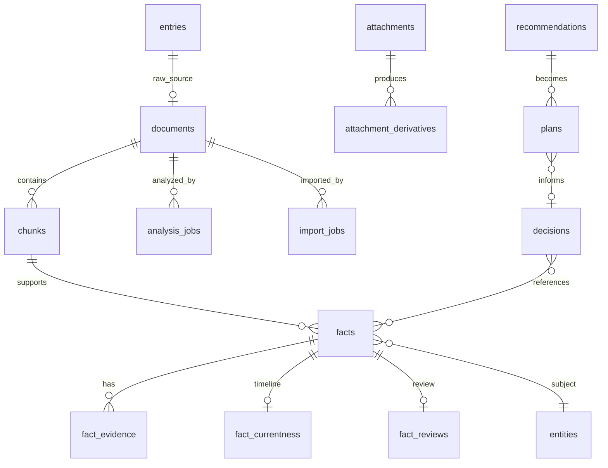

# 正本データモデル

## 正本/legacy境界

- `entries`/`structured_memories`: 既存データと移行互換のため保持。新規構造化情報の正本ではない。
- `documents`/`chunks`: 原文と検索単位。原文はFactより長寿命で、解析失敗時も失われない。
- `facts`: 構造化情報の正本。`fact_key`（概念・scope）、`valid_from/to`、`status`、`supersedes_fact_id`を持つ。
- `fact_evidence`: Factの根拠。会話chunk/画像attachment、`source_identity`、抽出モデル、引用、支持/反証を監査する。同じ画像hashや同じ会話は複数回取り込まれても独立Evidenceとして水増ししない。
- `analysis_jobs`: `document_id`、provider、model、prompt version、content hash、status、attempts、priority、理由、時刻、usageを保持する。相談に関連する未解析chunkを優先できる。
- `import_jobs`: ZIP hash、status、現在shard、取込件数、errorを保持し、分割ZIPの再開点になる。
- `attachment_derivatives`: 画像から得たOCR/Vision等の再生成可能な派生情報を保持する。原画像の正本ではない。
- `recommendations`/`plans`: 提案・実行計画をFactと混同しないための一時状態。Evidence、tradeoff、不足情報を保持し、ユーザーが採用して初めてDecisionへ関連付ける。
- `decisions`: 本人が明示した選択、理由、結果、後日評価を保持する。Recommendationやdraft Planを本人のDecisionとして自動確定しない。

Factの信頼判定では抽出confidenceだけでなく、明示Evidence、独立支持数、反証、推測表現、将来予定かを計算し、詳細を`trust_details_json`へ保存する。`personal_relevance=personal`かつreview済み・`retrieval_eligibility=eligible`のcurrent Factだけを現在情報として使う。

Migrationは`schema_migrations`に記録し、`010_requirements_cycle`適用前にはDBと添付を含む`.posbackup`を作成する。既存テーブルの削除・初期化は行わない。
