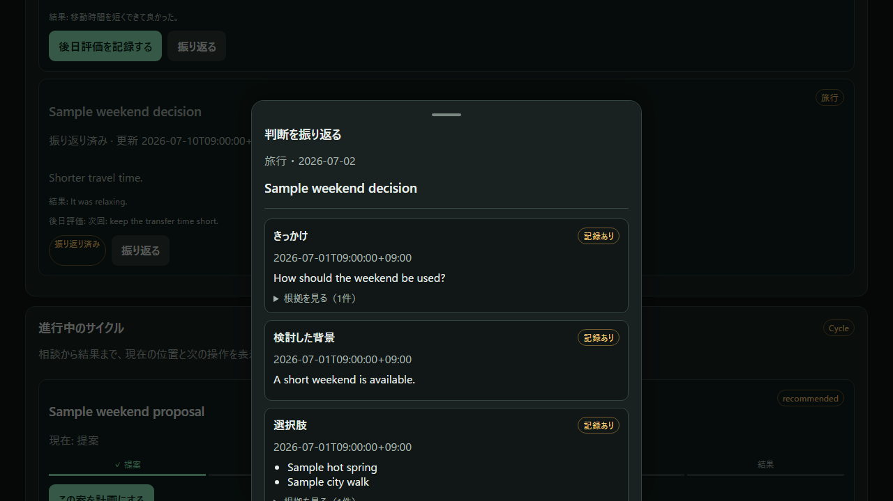
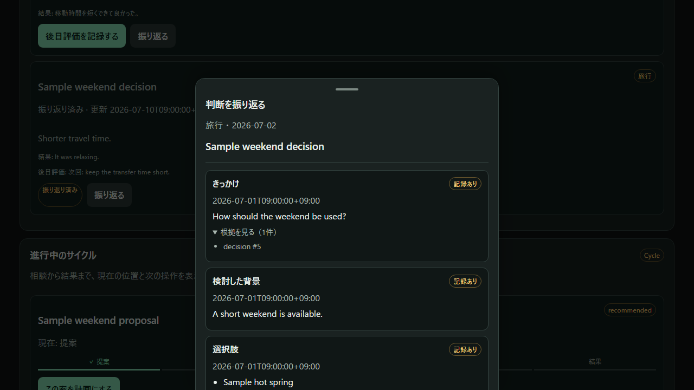
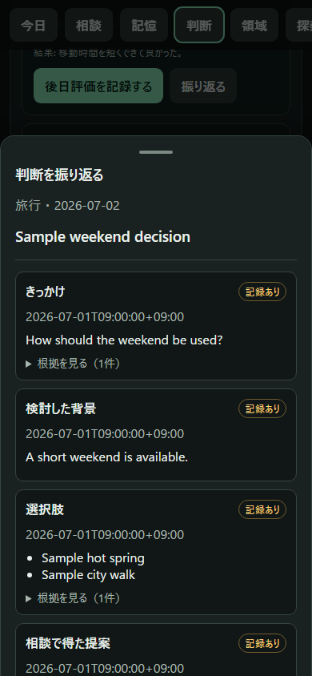
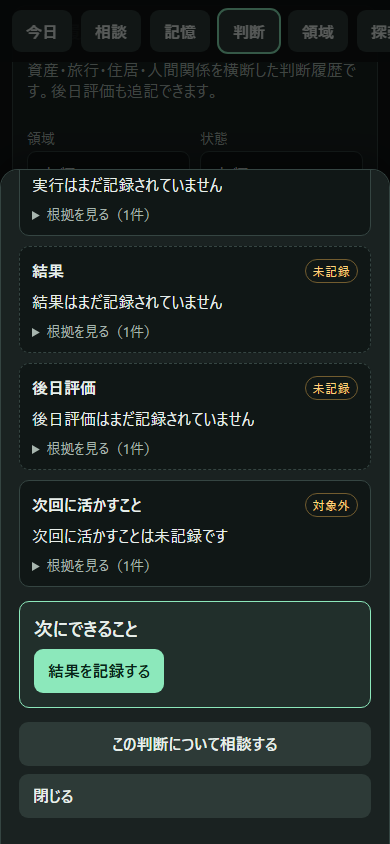
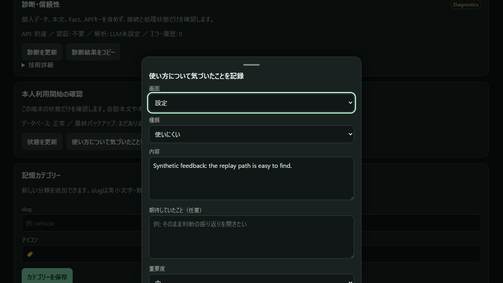

# Decision Replay visual review

The following screens are generated by the Verification server on port 8877 using only the fixed synthetic UX dataset. They are not production screenshots.

Generation creates manifest entries with `reviewed=false`. The public screenshot safety check accepts them only after a reviewer has actually opened the image, visually checked it, and recorded the current SHA-256 through `tools/approve_public_screenshots.py`.

Review checks: synthetic data only; no local paths, error traces, API keys, personal names, real assets or raw conversation content; readable primary action; no overlapping cards; sheets contained in the viewport; Japanese user-facing labels; and no sensitive content exposed by default.
