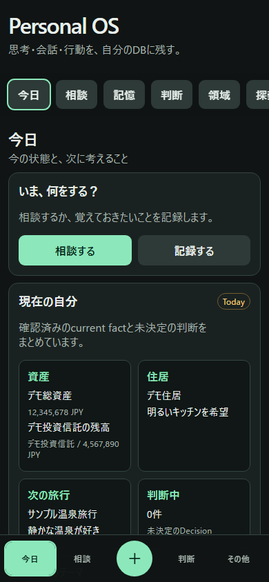
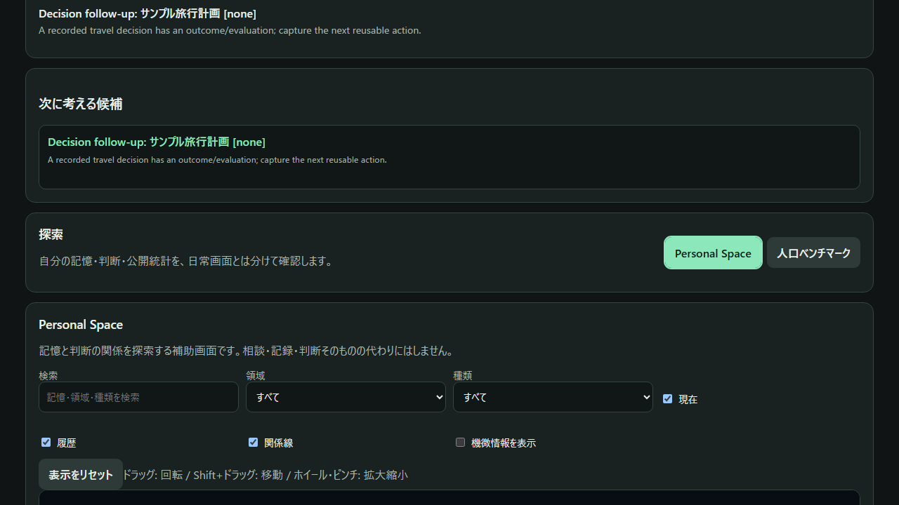
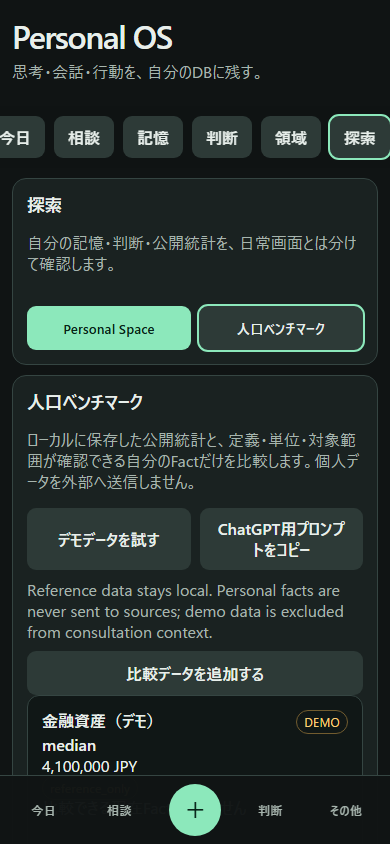

# UX Phase 5 Visual Review

## 実施条件

- Verification環境（port 8877）と毎回生成する一時SQLite DB
- 固定の合成データのみ。実在人物、実資産、会話本文、添付、APIキーは使用しない
- Desktop 1280 × 720 / 1440 × 900、Mobile 390 × 844 / 375 × 667

## 代表画面の目視確認

確認した点は、Primary Actionの初期表示、Bottom Navigationとの非重複、44px以上の操作対象、SheetのEsc／Focus復帰／背景スクロール固定、横Overflowなし、根拠の折りたたみ、機微ラベルの既定マスクである。

## Desktop

今日では「相談する」と「記録する」を最初の表示領域に置き、管理画面の導線は前面に出さない。相談では回答を先に表示し、参照した根拠は明示操作まで折りたたむ。資産・旅行・住居・人間関係は「現在の要約 → 最近の変化 → 関連する判断 → 履歴 → 根拠」の同じ順序で確認した。Personal Spaceは既定で機微ラベルを伏せ、人口ベンチマークは合成の参照データをロードした後の比較表示を確認した。

## Mobile

390 × 844 と 375 × 667 の両方で、Bottom Navigationが本文と重ならず、＋Sheet、その他Sheet、判断結果SheetがViewport内に収まることを確認した。記憶入力、画像追加、相談、根拠、探索、Personal Space Node Detail、ベンチマーク取込Sheet、Draft復元を実操作し、横方向Overflowがないことを自動検査した。

## 修正した点

- 記録は送信時に「保存しています…」と表示し、実APIの2xx応答後だけ成功表示とDraft削除を行うようにした。
- 失敗・Timeout時は「保存できませんでした。入力内容は保持しています」と表示し、再送できるようにした。
- SheetのEsc、Backdrop、Focus Trap、Focus復帰、背景スクロール固定を共通化した。
- Domain画面のCurrent/Recent/Decisions/History/Evidence構造とEmpty Stateを共通Rendererへ統一した。

全70画面は `screenshots/ux-phase5/manifest.json` に登録され、すべてSynthetic Data、`reviewed=true`、`contains_sensitive_data=false` として公開前検査する。

## 残課題

初回は構造・操作性のE2Eを優先した。pixel-perfectなVisual Regressionは、画面が安定してから追加する。
