# UX Phase 5 Visual Review

## 2026-08-02 Phase B-UX1 Stabilization 最終確認

- Verification環境の独立Temporary SQLite DBでDesktop/Mobile E2Eを実行し、Microsoft EdgeとPlaywright Chromiumの両方で成功した。
- 公開候補47枚（合計3,189,527 bytes）を1枚ずつ画像として目視確認し、`codex-visual-review`が2026-08-02T12:06:21.506746+00:00に承認した。全件がSynthetic Dataで、`reviewed=true`、`contains_sensitive_data=false`、現在のPNGとSHA-256が一致している。
- 375px幅で保存失敗Draftの3操作が窮屈だったため、「再試行する」を全幅、「今回は表示しない」と「破棄」を2列に整理した。
- 機微情報はデフォルトで値・根拠・原文をマスクし、明示操作後の詳細と「3件確認」区切りを別Screenshotで確認した。
- Unit Test 211件が成功（1件はHostでSymlink作成不可のためskip）、Memory Quality Benchmarkは44/44、Secret/Public/Screenshot SafetyはPASSした。1,100件・5,000件のReview Backlogも境界後のUrgentを欠落させず、一覧応答を10件へ抑えた。

## 実施条件

- Verification環境（port 8877）と毎回生成する一時SQLite DB
- 固定の合成データのみ。実在人物、実資産、会話本文、添付、APIキーは使用しない
- Desktop 1280 × 720 / 1440 × 900、Mobile 390 × 844 / 375 × 667

## 代表画面の目視確認

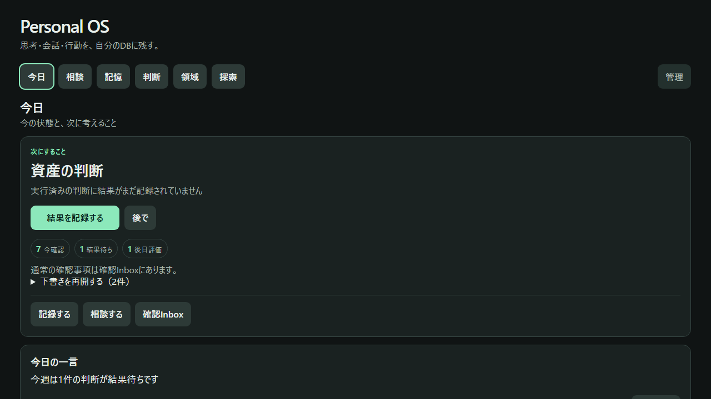

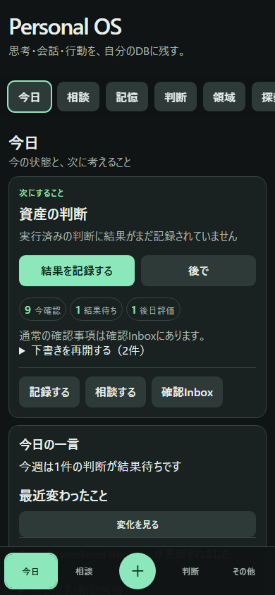

## Phase B-UX1: Today Action Centerと確認Inbox

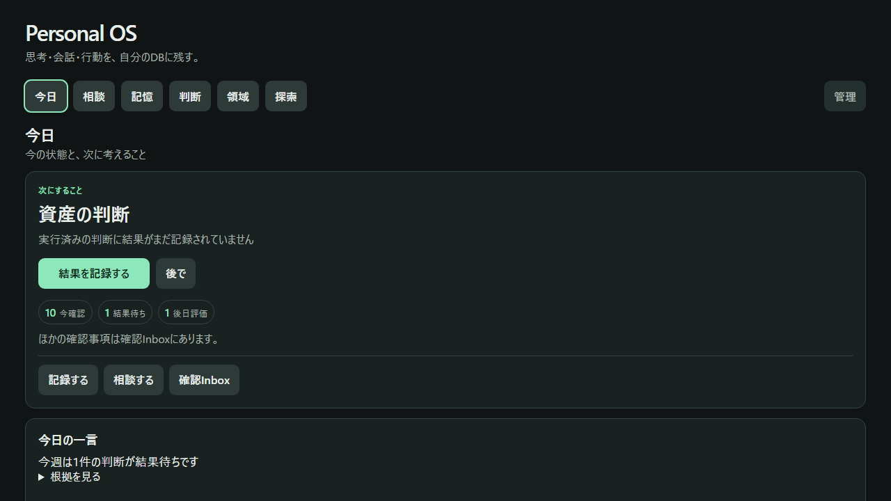

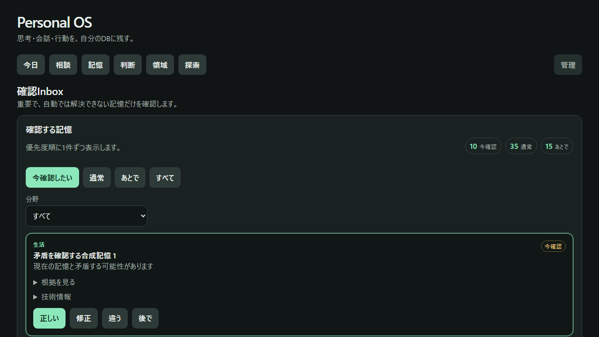

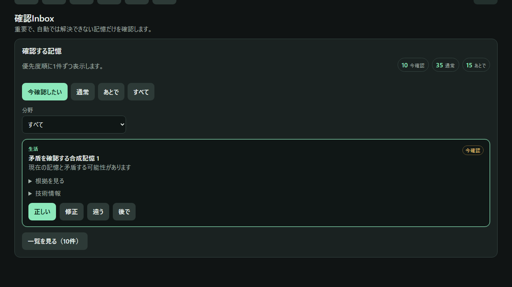

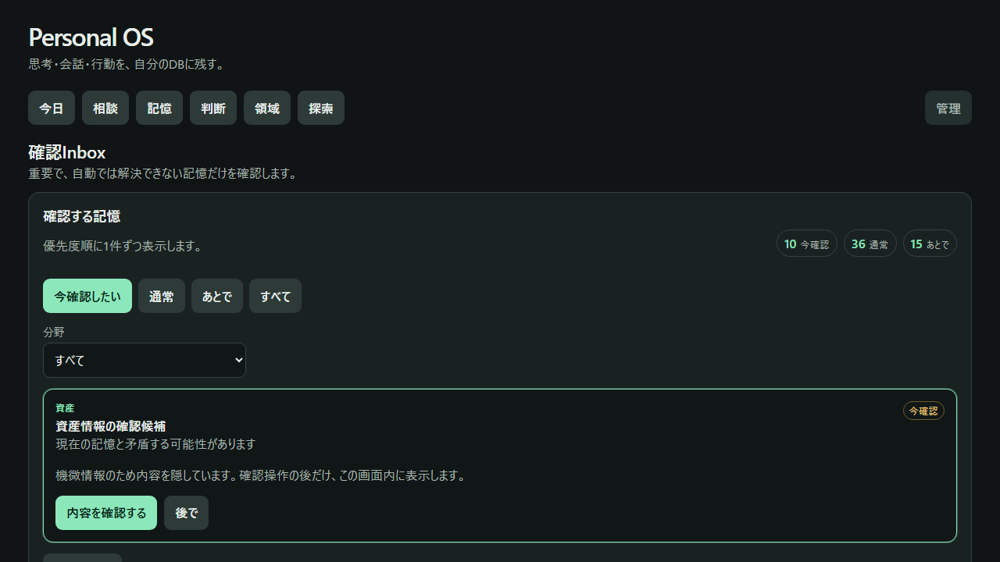

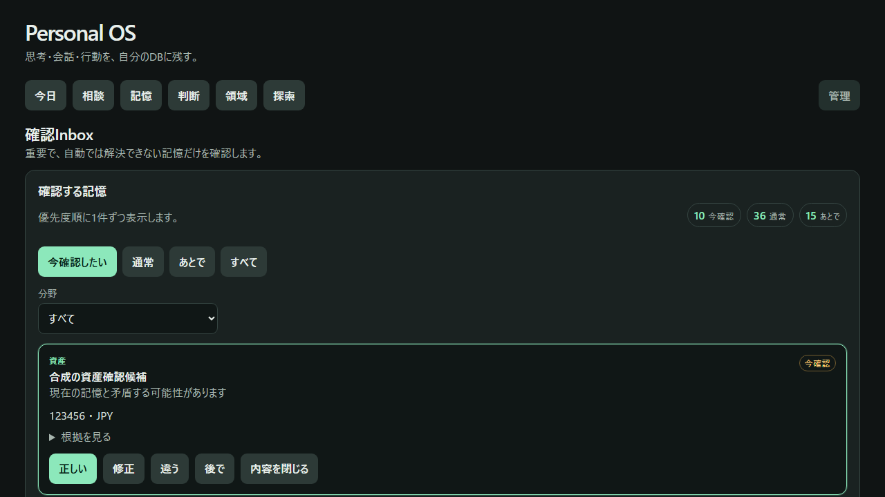

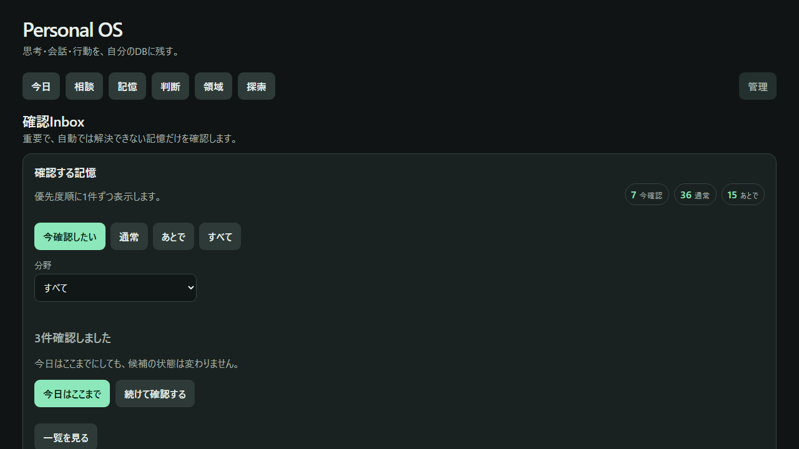

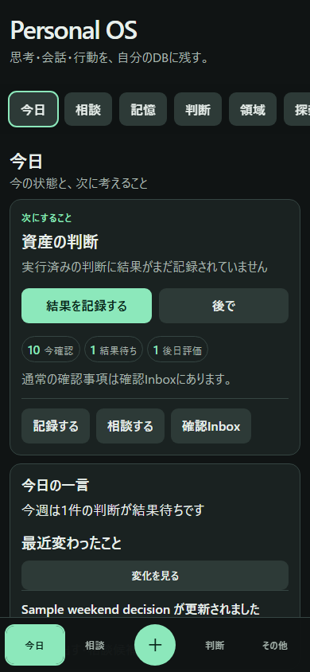

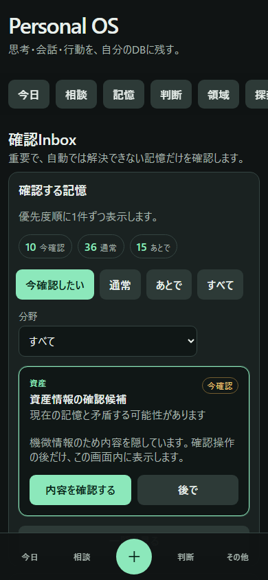

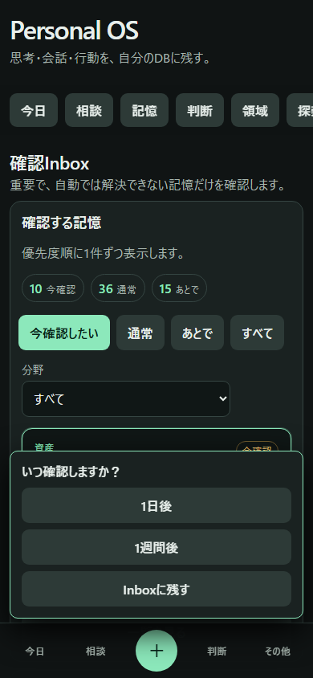

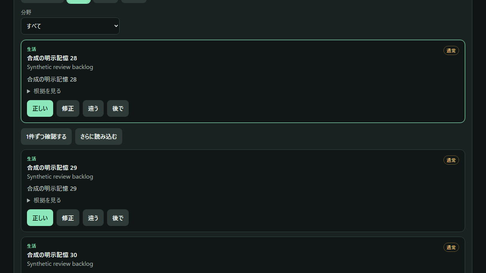

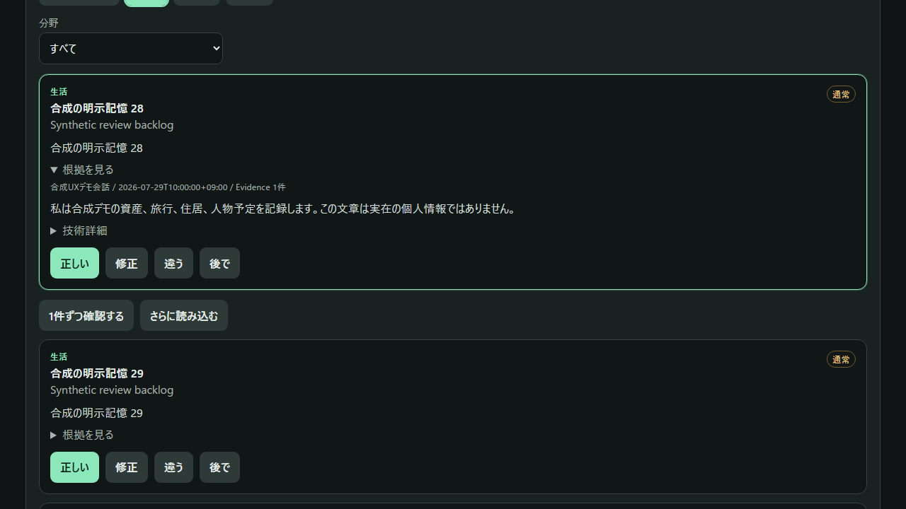

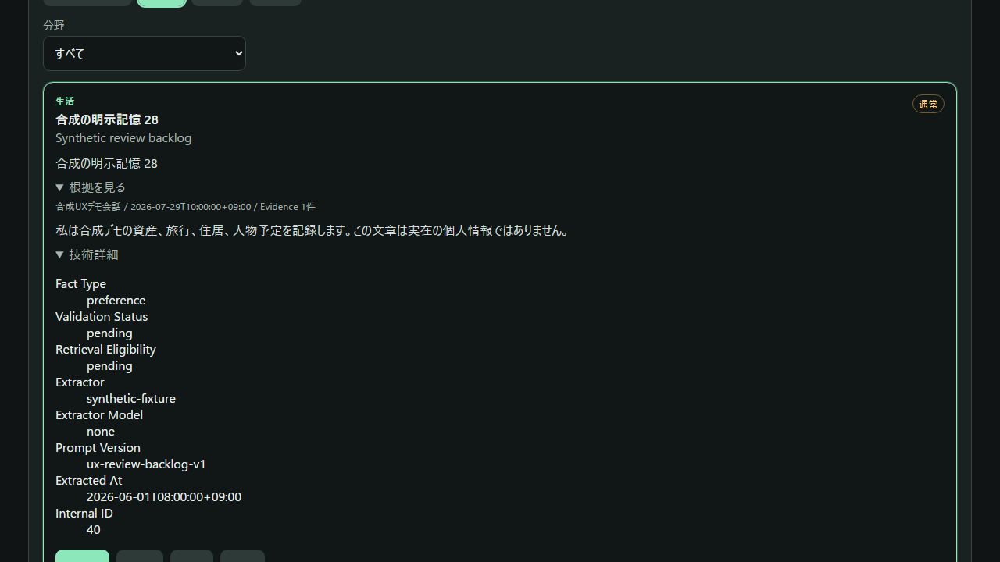

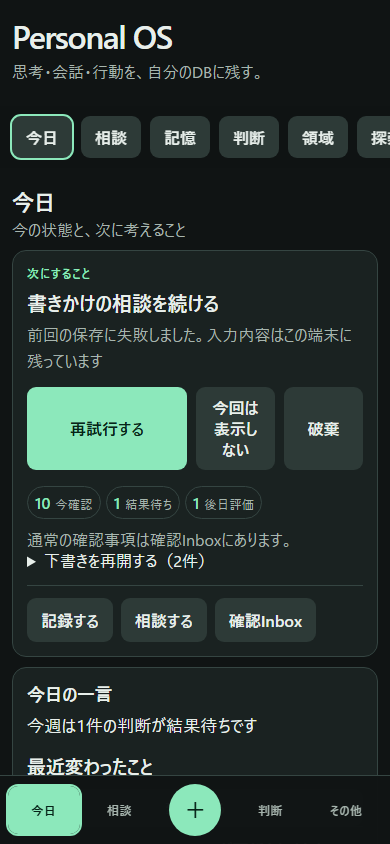

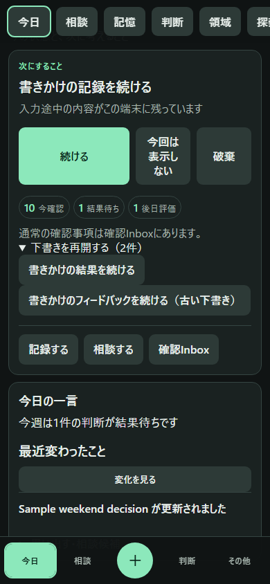

1,100件の完全Paginationと5,000件の性能検証に加え、固定Synthetic BacklogとMemory ProposalをBrowser E2Eで確認した。Todayは主Actionが1件、主Buttonが1件で、記録・相談・確認Inboxの3入口が最初のMobile Viewportに収まる。Inboxは初回10件だけを取得し、先頭1件のFocus Cardを表示する。機微候補は本文・値・原文をマスクし、初期状態には「内容を確認する」「後で」だけがある。明示表示後にだけ実Summary、値、確認操作が現れ、「内容を閉じる」で実内容がDOMから消えることをBrowser E2Eでも確認した。

通常候補では、一覧にEvidence本文・Source・Modelを含めず、「根拠を見る」を初めて開いた時だけ詳細APIから取得する。取得後も技術情報は二段目の「技術詳細」に閉じた。目視では、閉じた状態・Evidence表示・技術詳細表示の3画面に情報の重複やレイアウト崩れがないことを確認した。

共通Draft v2では、保存に失敗した短文が最優先Actionになり、古い・非優先・一時的に隠したDraftも「下書きを再開する」一覧から再開できる。判断結果とUX Feedbackは本文以外の補助項目も復元され、MobileのCardと操作ButtonがBottom Navigationに重ならないことを確認した。

目視確認では、Mobileでも主Action・記録・相談・確認Inboxが初期Viewportに収まり、保留メニューが下部Navigationより上へ表示された。機微情報の詳細表示前後と3件区切りは、ボタンの重なり、横Overflow、実データ露出がないことを画像で確認した。通常候補はTodayを占有せず、Inboxの件数は作業完了を強制する表現にしていない。

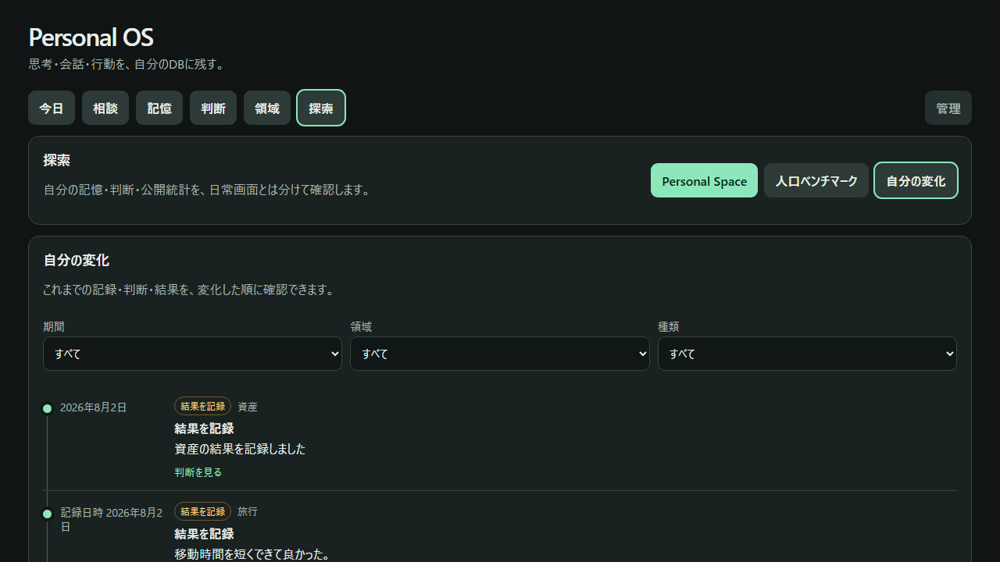

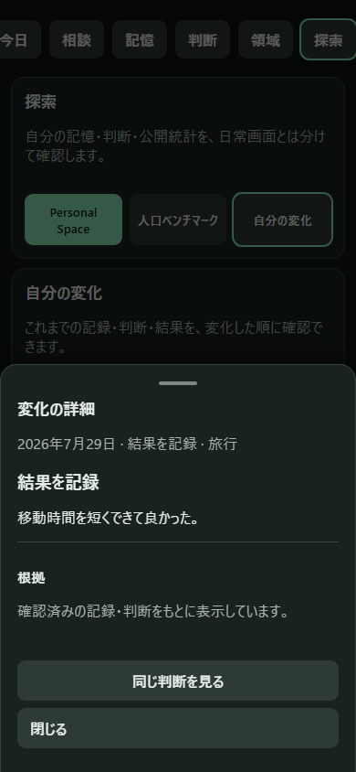

確認した点は、Primary Actionの初期表示、Bottom Navigationとの非重複、44px以上の操作対象、SheetのEsc／Focus復帰／背景スクロール固定、横Overflowなし、根拠の折りたたみ、機微ラベルの既定マスクである。

## Desktop

今日では「相談する」と「記録する」を最初の表示領域に置き、管理画面の導線は前面に出さない。相談では回答を先に表示し、参照した根拠は明示操作まで折りたたむ。資産・旅行・住居・人間関係は「現在の要約 → 最近の変化 → 関連する判断 → 履歴 → 根拠」の同じ順序で確認した。Personal Spaceは既定で機微ラベルを伏せ、人口ベンチマークは合成の参照データをロードした後の比較表示を確認した。

今日のダイジェストでは、相談・記録の直後に、事実ベースの一言と優先順付きの次の行動を置いた。表示した判断・資産・住居は固定Synthetic Fixtureのみで、実データや原文、絶対パス、APIキーは含まない。「根拠を見る」は折りたたみのままなので、最初の画面を圧迫しない。

## Mobile

390 × 844 と 375 × 667 の両方で、Bottom Navigationが本文と重ならず、＋Sheet、その他Sheet、判断結果SheetがViewport内に収まることを確認した。記憶入力、画像追加、相談、根拠、探索、Personal Space Node Detail、ベンチマーク取込Sheet、Draft復元を実操作し、横方向Overflowがないことを自動検査した。

ダイジェストの相談候補は、タップ後に相談画面へ遷移して文面だけを入力する。回答送信は行われず、入力は本人が編集できることをBrowser E2Eで確認した。

Timelineでは、意味的な日付、領域、日本語の種類ラベルを左から追えるようにし、線やマーカーを本文より強くしない。Mobileの詳細は共通Sheetに収め、閉じた後は元CardにFocusが戻る。資産・人間関係・健康は既定で本文を伏せ、試算・提案・未確認推論は表示しない。

## 修正した点

- 記録は送信時に「保存しています…」と表示し、実APIの2xx応答後だけ成功表示とDraft削除を行うようにした。
- 失敗・Timeout時は「保存できませんでした。入力内容は保持しています」と表示し、再送できるようにした。
- SheetのEsc、Backdrop、Focus Trap、Focus復帰、背景スクロール固定を共通化した。
- Domain画面のCurrent/Recent/Decisions/History/Evidence構造とEmpty Stateを共通Rendererへ統一した。

公開レビュー画面は `screenshots/ux-phase5/manifest.json` に登録する。E2E生成直後はすべて `reviewed=false` とし、Synthetic Dataであることと `contains_sensitive_data=false` を確認した目視承認後だけ、ハッシュ・承認者・承認日時付きで公開前検査を通過する。

## 残課題

初回は構造・操作性のE2Eを優先した。pixel-perfectなVisual Regressionは、画面が安定してから追加する。
